title: Processing errors in functional way
author:
  name: Lukáš Rychtecký
  twitter: lukasrychtecky
controls: true
style: style.css

--

# Processing errors in functional way
## Lukáš Rychtecký
## [https://twitter.com/LukasRychtecky](https://twitter.com/LukasRychtecky)

--

### Outline

* Motivation (Naive programming)
* Reality
* Processing errors in functional way
* Railway Oriented Programming

--

### Motivation (Naive programming)

As a user I want to update my name and e-mail address.

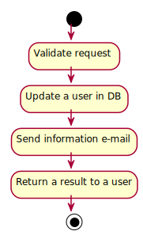
```fsharp
type Request = {
  userId: int
  name: String
  email: string
}
```

--

### Motivation - Imperative code

As a user I want to update my name and e-mail address.

```csharp
string UpdateNameAndEmail (request)
{
  validateRequest(request);
  db.updateUser(request);
  mail.sendEmail(request);
  return "Success";
}
```

--

### Motivation - Functional code

As a user I want to update my name and e-mail address.

```fsharp
let updateNameAndEmail request =
  request
  >> validateRequest
  >> updateUser
  >> sendEmail
  >> formatResponse
```

--

### Reality


--

### Reality

As a user I want to update my name and e-mail address **and see meaningful error message when something goes wrong**.

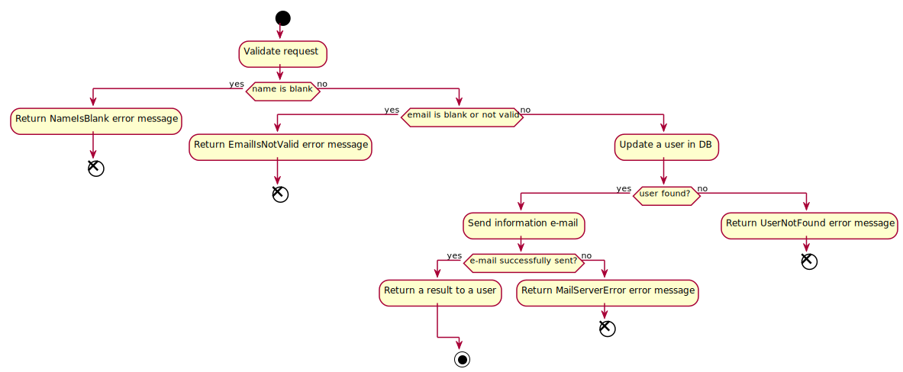

--

### Reality - Imperative code with error handling

```csharp
string UpdateNameAndEmail (request)
{
  var isValid = validateRequest(request);
  if (!isValid) {
    return "Invalid request";
  }
  db.updateUser(request);
  mail.sendEmail(request);
  return "Success";
}
```

--

### Reality - Imperative code with error handling

```csharp
string UpdateNameAndEmail (request)
{
  var isValid = validateRequest(request);
  if (!isValid) {
    return "Invalid request";
  }
  var user = db.updateUser(request);
  if (user == null) {
    return "User not found";
  }
  mail.sendEmail(request);
  return "Success";
}
```

--

### Reality - Imperative code with error handling

```csharp
string UpdateNameAndEmail (request)
{
  var isValid = validateRequest(request);
  if (!isValid) {
    return "Invalid request";
  }
  try {
    var user = db.updateUser(request);
    if (user == null) {
      return "User not found";
    }
  } catch {
    return "DB error";
  }
  try {
    mail.sendEmail(request);
  } catch {
    return "Mail error";
  }
  return "Success";
}
```
An error handling adds 14 lines extra! 200% growth!

--

### Reality - Functional code

```fsharp
let updateNameAndEmail request =
  request
  >> validateRequest
  >> updateUser
  >> sendEmail
  >> formatResponse
```

--

### Reality - Functional code with error handling

```fsharp
let updateNameAndEmailWithErrorHandling request =
  request
  >> validateRequest
  >> updateUser
  >> sendEmail
  >> formatResponse
```

--

### Processing errors in functional way - Design

[](img/rop-bypass.svg)

How to bypass a mainstream when a function "fails"?

Type for rescue!

```fsharp
type Result =
  | Success
  | ValidationError
  | UpdateError
  | MailError
```

But sum types are too specific for generic cases.

--

### Processing errors in functional way - Design

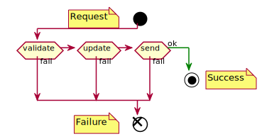

How can a function have more than one output?


```fsharp
type Result =
  | Success
  | Failure
```

Generic, but without data

--

### Processing errors in functional way - Design


How can a function have more than one output?


```fsharp
type Result<'TEntity> =
  | Success of 'TEntity
  | Failure of string
```

Good enough

--

### Processing errors in functional way - Design


* Each use case function will be equivalent to a single function
* The function returns a sum type "Success" or "Failure"
* The use case function will be built from a series of smaller functions (a step in a flow)

--

### Railway Oriented Programming - Switch

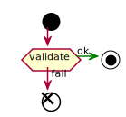

A simple validation function

```fsharp
let validate input =
  if input.name = "" then
    Failure "Name must not be blank"
  else if input.email = "" then
    Failure "E-mail must not be blank"
  else
    Success input
```

--

### Railway Oriented Programming - Switch

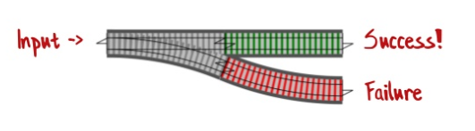

--

### Railway Oriented Programming - Connecting switches

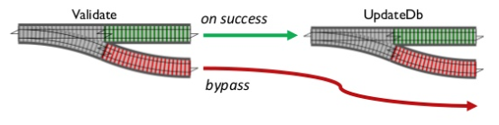

--

### Railway Oriented Programming - Connected switches

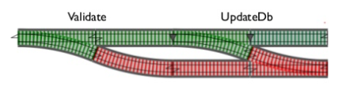

--

### Railway Oriented Programming - Switches

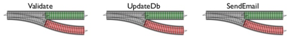

--

### Railway Oriented Programming - Flow as switches

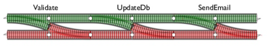

But how to connect them?

--

### Railway Oriented Programming - Composing switches

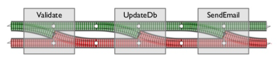

Each box is a switch function

--

### Railway Oriented Programming - Composing one-track

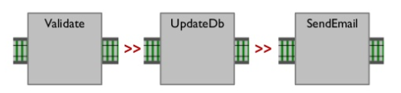

Composing one-track functions fine

--

### Railway Oriented Programming - Composing two-track


Composing two-track is fine too

--

### Railway Oriented Programming - Composing switches issue

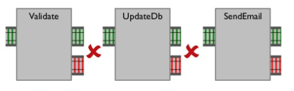

But cannot compose them

--

### Railway Oriented Programming - Building adapter

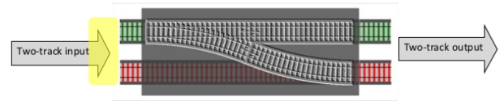

```fsharp
let adapt switchFunction =
  fun twoTrackInput ->
    match twoTrackInput with
    | Success s -> switchFunction s
    | Failure f -> Failure f
```
--

### Railway Oriented Programming - Bind


We can simplify the function and rename it to common name **bind**

```fsharp
let bind switchFunction twoTrackInput =
  match twoTrackInput with
  | Success s -> switchFunction s
  | Failure f -> Failure f
```
--

### Railway Oriented Programming - Bind example

```fsharp
let nameNotBlank input =
  if input.name = "" then
    Failure "Name must not be blank"
  else Success input

let nameMaxLength input =
  if input.name.Length > 255 then
    Failure "Name must not be longer then 255 chars"
  else Success input

let emailNotBlank input =
  if input.email = "" then
    Failure "E-mail must not be blank"
  else Success input
```
--
### Railway Oriented Programming - Bind + composition


```fsharp
let validateRequest =
  bind nameNotBlank
  >> bind nameMaxLength
  >> bind emailNotBlank
```
--

### Railway Oriented Programming - Bind + composition >>=


```fsharp
let (>>=) twoTrackInput switchFunction =
  bind switchFunction twoTrackInput

let validateRequest twoTrackInput =
  twoTrackInput
  >>= nameNotBlank
  >>= nameMaxLength
  >>= emailNotBlank
```

`>>=` - common symbol for bind

--

### Thank you for your attention

References

* Scott Wlaschin
* [https://fsharpforfunandprofit.com/rop](https://fsharpforfunandprofit.com/rop)
* [https://vimeo.com/113707214](https://vimeo.com/113707214)
* [https://bit.ly/rop-example](https://bit.ly/rop-example) - example

--

### Single track function

A simple function that doesn't generate errors


```fsharp
let canonicalizeEmail input =
  { input with email = input.email.Trim().ToLower() }
```
--

### Single track function - example

```fsharp
let map singleTrackFunction =
  bind (singleTrackFunction >> Success)

let validateRequest twoTrackInput =
  twoTrackInput
  >>= nameNotBlank
  >>= nameMaxLength
  >>= emailNotBlank
  map canonicalizeEmail
```

--

### Dead-end function

A function that doesn't return anything (side effect, ...)


```fsharp
let updateDb request = 
  // do real DB update
  // return nothing at all
```
--

### Dead-end function - code


```fsharp
let tee deadEndFunction twoTrackInput =
  deadEndFunction twoTrackInput
  twoTrackInput
```
--

### Dead-end function - example

```fsharp
let validateRequest twoTrackInput =
  twoTrackInput
  >>= nameNotBlank
  >>= nameMaxLength
  >>= emailNotBlank
  map canonicalizeEmail
  tee updateDb
```
